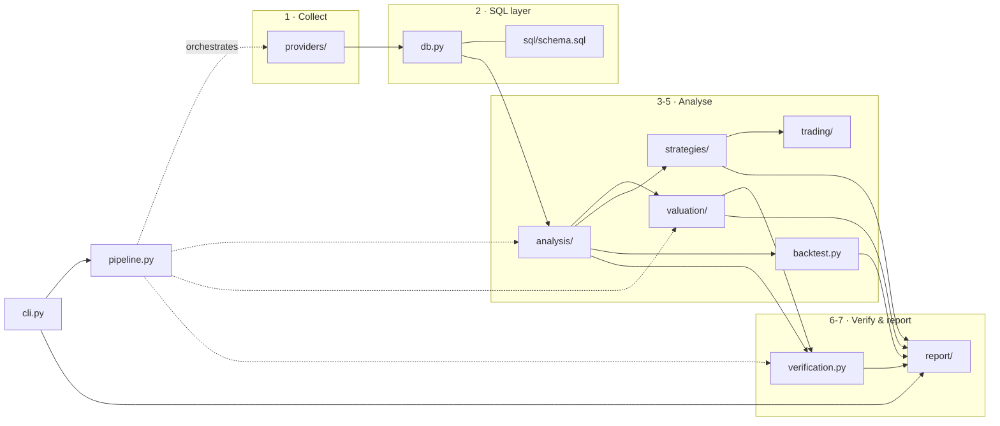

# Architecture

A map of the merged codebase — the original valuation engine plus the features
pulled across from [`indian-stock-signal-ai`](https://github.com/hemantsatishjadhav06-ai/indian-stock-signal-ai).

Generated with [Understand Anything](https://github.com/Egonex-AI/Understand-Anything):
its `scan-project.mjs` and `extract-import-map.mjs` produced the deterministic
file inventory and the import graph (46 files, 56 import edges, 16 module-level
dependencies); the synthesis below is written against that data. The
machine-readable graph is committed at [`.ua/knowledge-graph.json`](../.ua/knowledge-graph.json).

Regenerate with:

```bash
node <ua>/skills/understand/scan-project.mjs "$PWD" /tmp/ua-scan.json
node <ua>/skills/understand/extract-import-map.mjs /tmp/ua-in.json /tmp/ua-imports.json
```

---

## The pipeline

One path, left to right. Each stage reads only from the stage before it, and
everything after stage 2 reads from SQL rather than from provider payloads.



## Module map

| Layer | Module | Lines | What it owns |
|---|---|---:|---|
| 0 · orchestrate | `pipeline.py` | 347 | Runs collect → load → analyse → value → signal → verify. Orchestration only; computes no numbers. |
| 0 · orchestrate | `cli.py` | 225 | Argument surface, assumption overrides, terminal verdict card. |
| 0 · orchestrate | `config.py` | 228 | Valuation assumptions, risk/signal settings, `DataSettings` from env, benchmark-per-market. |
| 1 · collect | `providers/` | 1,794 | Screener.in, Yahoo, OpenBB, TwelveData, Alpaca, Indian-Stock-Market-API, offline bundles. Failure is data, not an exception. |
| 2 · SQL | `sql/schema.sql` | 547 | 22 tables + 11 derived views. The arithmetic lives here. |
| 2 · SQL | `db.py` | 139 | sqlite runtime, staged loads, provenance ledger. |
| 3 · analyse | `analysis/` | 2,189 | Fundamentals, forensics, technicals, commodity linkage, regime + 0-100 scores. |
| 4 · value | `valuation/` | 610 | Buffett DCF, Graham, Bharat Shah, Buffetology, margin of safety. |
| 5 · signal | `strategies/` | 642 | The 9-strategy library (JSON) and the score-fusion engine. |
| 5 · signal | `backtest.py` | 317 | Cost-aware, gap-aware daily-bar backtester. |
| 5 · signal | `trading/` | 269 | Paper book and the risk model. |
| 6 · verify | `verification.py` | 345 | The weighted confidence score and its caps. |
| 7 · report | `report/` | 1,964 | SVG chart toolkit and the self-contained HTML dashboard. |

## Where the two codebases met

`indian-stock-signal-ai` was a FastAPI + React service using pandas, numpy,
httpx and SQLModel. Everything worth keeping was reimplemented on the standard
library so the merged engine keeps its zero-dependency core and its single
`collect → report` path.

| Feature from signal-ai | Landed as | Notes |
|---|---|---|
| yfinance / TwelveData / Alpaca / IndianAPI adapters | `providers/market_data.py` | Rewritten on `urllib`; joins the existing first-supplier-wins chain. |
| `curl_cffi` Chrome impersonation | `providers/base.py` | Optional; tried once on a 429 before backing off. |
| pandas indicators | `analysis/technicals.py` | ADX/±DI, VWAP and RVOL added to the existing set, in pure Python. |
| Regime detection | `analysis/regime.py` | Volatility overrides direction. |
| `strategies.json` (9 strategies) | `strategies/strategies.json` | Carried across unchanged — it is data, not code. |
| Score fusion + gates | `strategies/engine.py` | A gate failure beats any score, and the blocking gate is named. |
| Cost-aware backtester | `backtest.py` | Indicators recomputed on expanding prefixes to guarantee no look-ahead. |
| SQLModel paper book | `trading/paper.py` | Moved onto the engine's own sqlite layer. |
| Position sizing | `trading/risk.py` | Refuses with a reason instead of silently sizing zero. |
| React Signals/Backtest tabs | `report/dashboard.py` | Became sections of the one self-contained HTML report. |

**Deliberately not carried across:** the FastAPI service, the React SPA, Docker
and Render deployment config, and the paper-trading REST routes. The merge
target is a CLI plus a static report, so a web tier would have added a
dependency surface for no gain against that shape. The paper book itself did
come across — only its HTTP layer was dropped.

## The two lenses, kept apart

The design decision most worth preserving from signal-ai: the **fundamental**
and **technical** views never merge into a single opinion.

- `valuation/` asks *what is this business worth* → intrinsic value, margin of
  safety, a 10-year horizon.
- `strategies/` asks *is this a tradeable setup right now* → fused score, gates,
  entry/stop/target, a days-to-weeks horizon.

They share the SQL layer and nothing else, and the report presents them as
separate sections. A stock can be a buy on one lens and a no-trade on the other;
collapsing them would hide exactly the disagreement a reader needs to see.

## Invariants worth knowing before editing

1. **Analysis reads SQL, never provider payloads.** Anything else breaks
   reproducibility, which is the product.
2. **`shares_outstanding` shares the scale of the monetary amounts** (crore of
   shares beside crore of rupees), so every per-share view is a plain division.
3. **Missing data lowers the verification score; it is never imputed.** A
   skipped forensic check is `skipped`, never `pass`.
4. **No dual-axis charts.** Currency and percentage go in stacked panels sharing
   one x-axis.
5. **The backtester must not see the future.** Indicators are computed on
   expanding prefixes; the entry decision and its fill both use the same bar's
   close.
